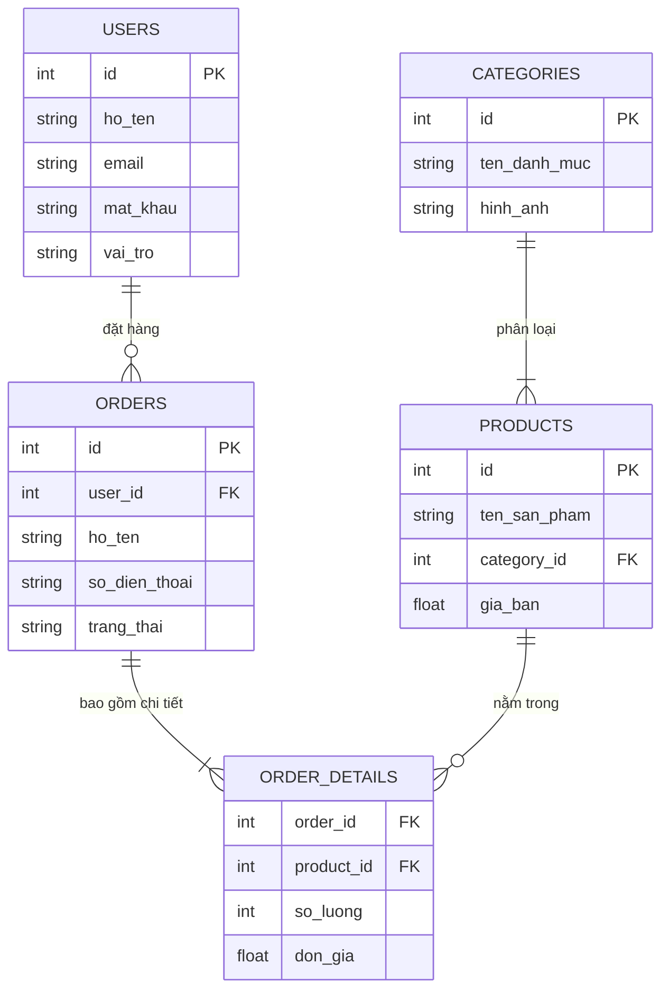

# Dự án Quản lý Cửa hàng Nông sản (AgriMarket)

## Sơ đồ Cơ sở dữ liệu (Database Diagram)
Dưới đây là sơ đồ thực thể liên kết (ERD) của cơ sở dữ liệu `nongsan_db`:

```mermaid
erDiagram
    USERS {
        int id PK
        string ho_ten
        string email
        string mat_khau
        string vai_tro
    }
    CATEGORIES {
        int id PK
        string ten_danh_muc
        string hinh_anh
    }
    PRODUCTS {
        int id PK
        string ten_san_pham
        int category_id FK
        float gia_ban
    }
    ORDERS {
        int id PK
        int user_id FK
        string ho_ten
        string so_dien_thoai
        string trang_thai
    }
    ORDER_DETAILS {
        int order_id FK
        int product_id FK
        int so_luong
        float don_gia
    }

    USERS ||--o{ ORDERS : "đặt hàng"
    CATEGORIES ||--|{ PRODUCTS : "phân loại"
    ORDERS ||--|{ ORDER_DETAILS : "bao gồm chi tiết"
    PRODUCTS ||--o{ ORDER_DETAILS : "nằm trong"
```